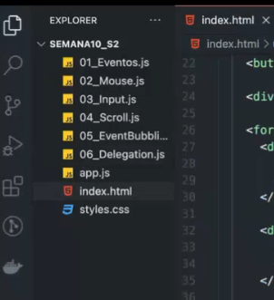
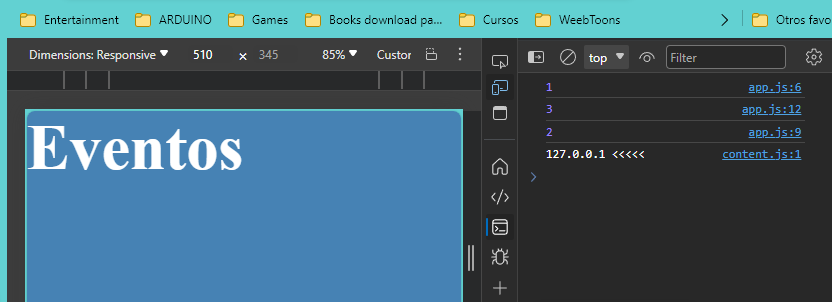
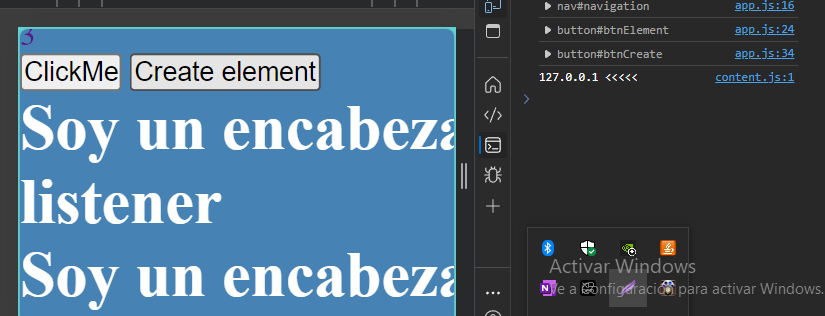

# EVENTOS

Cualquier interaccion que realiza el usuario con la pagina
click, scroll, escribir, hover,etc
Pero tambien puede ser eventos del navegador, como cuando carga la pagina por primera vez

## Evento o listener

### Partes de un listener

Elemento que emitira el evento, tipo de evento a ejecutar y callback o funcion que realizar el trabajo.

#### Llamar a que se ejecute cuando carga la pagina:

let documento = document;

documento.addEventListener('DOMContentLoaded', ()=> {
    console.log('Me ejecute cuando cargo la pagina');
})

Entre estos eventos, dado que espera a que cargue la pagina, va a tomar el numero 2 al ultimo, aparte de eso, sigue el orden sucesivo de las lineas:

console.log(1);

documento.addEventListener('DOMContentLoaded', ()=> {
    console.log(2);
})

console.log(3);

### Llamar a eventos con el mouse

https://developer.mozilla.org/en-US/docs/Web/API/MouseEvent

The mouseout event is fired at an Element when a pointing device (usually a mouse) is used to move the cursor so that it is no longer contained within the element or one of its children. [https://developer.mozilla.org/en-US/docs/Web/API/Element/mouseout_event]

const elementNavigation = document.getElementById('navigation');

console.log(elementNavigation);

elementNavigation.addEventListener('mouseout', () =>{
    console.log('Saliste del elemento');
})

<!-- mouseout mouseover -->
Al hacer click en el boton realiza un movimiento:

const elementButton = document.getElementById('btnElement');

console.log(elementButton);

elementButton.addEventListener('click', ()=>{
    console.log('Hizo click al boton');
    alert('Hola')
})

#### Crear y agregar un elemento

const btnCreate = document.getElementById('btnCreate');
const container = document.getElementById('container')

console.log(btnCreate);

// FUNCION QUE VA A CREAR EL ELEMENTO

btnCreate.addEventListener('click', createElement);

function createElement(){
    const element = document.createElement('h1');
    element.textContent='Soy un encabezado creado con un listener';
    // container.appendChild(element);
    printElement(element);

}
// FUNCION QUE VA A COLOCAR EL ELEMENTO

function printElement(element){
    container.appendChild(element);
}

## EVENT TARGET

btnCreate.addEventListener('click', (e) => {
    console.log(e.target);
});

### SUBMIT FORM

### LLENANDO EL FORMULARIO (CHANGE, INPUT, BLUR)

CHANGE trabaja una vez termino de escribir, input es reactivo, por cada letra realiza el evento.

inputName.addEventListener('blur',(e)=>{
    console.log(event,e);
    console.log('Evento blur');
})

inputName.addEventListener('change',(e)=>{
    console.log(event,e);
    console.log('Evento change');
})

inputLastName.addEventListener('input',(e)=>{
    console.log(event,e);
    console.log('Evento input');
})

### ENVIANDO EL FORMULARIO se agrega listener al formulario al boton submit

containerForm.addEventListener('submit', (e) => {
    e.preventDefault;
    // El prevent default evita que se refresque la pagina
    console.log(e);
})

### SCROLL

Revisa cuanto se esta scrolleando en la pagina, bajando:

window.addEventListener('scroll', (e) =>{
    console.log(e);
    console.log(window.scrollY);
    const scrollTop = window.scrollY;
  
    if(scrollTop>1000){
        console.log('Aparece elemento');
    } else{
        console.log('No aparece elemento');
    }
})
